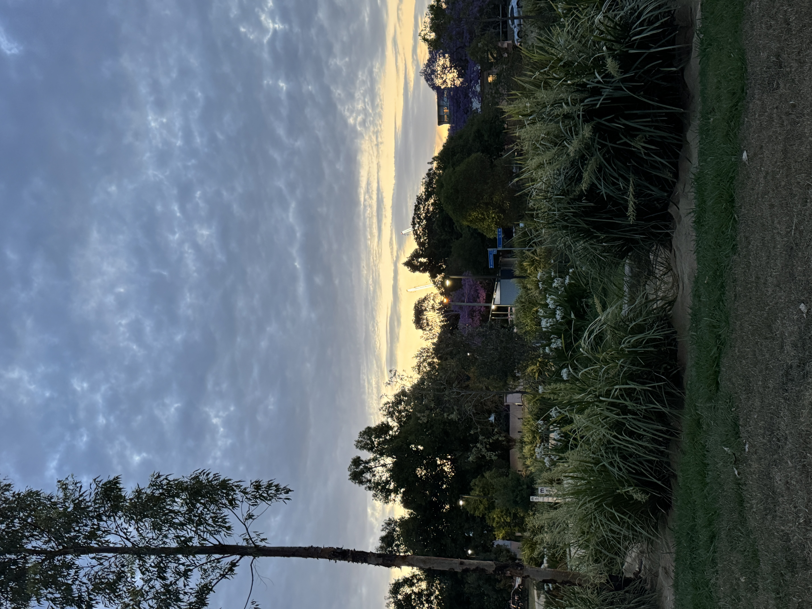

So things are pretty grim right now, aren't they?

I certainly feel so.

Since the pandemic, being alive has felt like an exercise in massocism, going from one unprecedented event to the next.
What's worse is that algorithmic feeds and sycophantic AI agents have silo'd us into prisons that push all of our
emotional buttons and ensure that we are more polarised/anxious/confused than ever before.

Looking at the news and seeing how people talk online.. my heart breaks. People who I am sure are otherwise good -
especially if you spend time getting to know them - have accepted and espouse hateful rhetoric. Evil political leaders
with "common sense" answers have taken advantage of this so now there's nazi piss and shit everywhere.

Considering all of this, I've often wondered lately if democracy was a mistake. Or at least is in need of a major
overhaul. The average human mind just doesn't seem to be very good at thinking about the needs of every person vs the
needs of themself. There's an entire planet of systems and levers but the only thing that gets people to the polls is
depraved slogans like "adult crime, adult time" (a successful line that got Queenslanders to vote for putting children
in jail).

It's infuriating to me that everything is up for debate. For instance people who _don't know anything_ about being
transgender get the same voting power (or perhaps more depending on geographical factors such as gerrymandering) as me,
a trans woman of three years' lived experience.

The conservative "government should be as small as possible" argument fascinates me. Because if we could agree that some
things are **not up for debate** (ie, basic human rights for all, health care for all, stop the genocide, end all wars)
then perhaps I'd be on board?? Imaging skipping all of that and just making sure that the trains work. But it just ain't
so and it never will be.

So we are doomed to the lowest common denominator.

Every issue needs to take into account every viewpoint, even if it's reprehensible, and so every time I've gone to the
polls the last few years it's been with great reluctance. The left-leaning major party is certainly better than the
other one but they're still going to enact weak policies.

This leaves us with a pathway to change that I think looks as follows:

1. An issue exists
2. Symptoms affect an increasing number of people
3. Solutions are proposed, discussed, protested over
4. Eventually a majority of people agree
5. If the majority of leaders agree with the majority of people then the change occurs

I use the term `symptoms` very deliberately. No matter how good an idea is, it won't gain traction unless it's affecting
a lot of people. So-called "Australia"'s treatment of its indigenous people is a prime example of this. The Australian
people are broadly cruel, selfish and racist and so they don't care about how badly treated the Aboriginal people are.
Any attempt to improve outcomes for Aboriginal people is "woke" or dangerous or unfair. I am embarrased to be an
Australian because of this and it's possible that in my lifetime there won't be meaningful change.

Issues with climate can be seen in a similar manner. Any policy to mitigate the risk of climate catastrophe will be
tokenistic at best until it gets so bad that it cannot be ignored. Climate change won't be the end of human life on
earth - because we are resilient and will persist - however the cruel destruction to lives and ecosystems will be
unimaginable before we get to that point.

---

To most reasonable people, the developments of the last few years feel to represent an overwhelming step backwards. And
it's true: a massive amount of real harm has been done to innocent people, a lot of which will never be answered for.

But the end of all this is coming soon.

Fascism always burns itself out. Their methods and arguments are getting more extreme not because they are winning.. but
because they are losing momentum and becoming more desperate to keep up the lies. The more desperate they become the
more insane they will be until eventually they die. The orange fuckhead's administration will be remembered as
incompetent and Republicans will be shamed into silence for the next decade.

It's only a relative handful of votes that flipped red over the last few years.

And the path back is long and fraught with danger.

But it's already happening.

The wind is blowing the other way.

