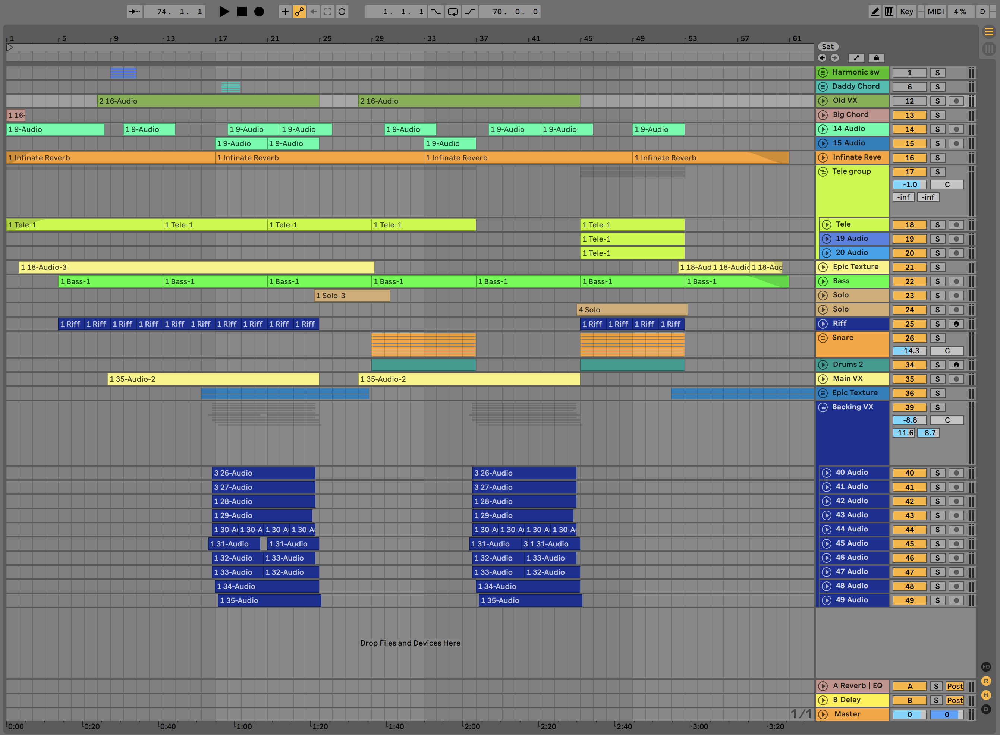
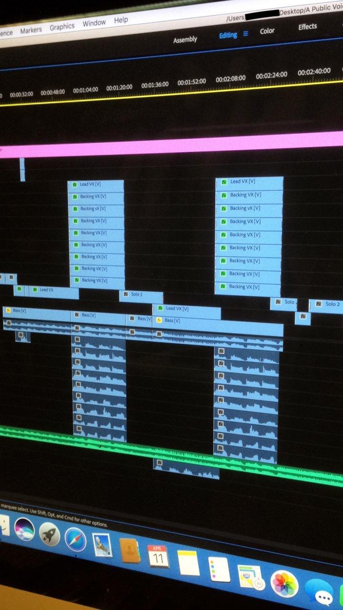

The recording for this song began in early 2018. I was starting out as a music student at QUT and was keen to be working
on new music.

This particular song came chorus first. Sometime in 2017 I was playing piano with a friend on bass and I stumbled across
what became the main vocal line of the chorus. The friend and I jammed on it for a while and then I recorded it as a
voice memo on my phone. I later found the recording and decided to sing it and fill the spaces with harmonies.

At this point I had no idea where the song was coming from or going. So that was the next challenge. Fill out the rest
of the song, taking it from a glorified chorus to a whole statement of its own. I continued reaching into the past
through my voice memos and found a recording of my school's bell sound. I used this to make the intro melody that you
hear while all the ambient effects were building up.

All of this added up to an almost complete song, comprising an intro, chorus, chord progression, and harmonies. What
remained was to come up with a verse and then work out the final structure. I came up with a verse melody and ultimately
decided on a structure of intro, verse, chorus, solo, verse, chorus, solo, outtro.

In this state the song remained for a month or two.

Fast forward to April 2018, my family went away for a week and I stayed home to have some time to work. During this week
I did the solos, lyrics, lead vocal and filmed the video.

The solos were improvised. It took a few takes to get them right but otherwise nothing complex. I wrote the lyrics in
the late afternoon and then did the vocals that evening. The lyrics have shadows of meaning but generally I was being
silly with them.

I think the only important lyric is the 'public void' bit. The first real programming project I attempted was an Android
app, using the Java programming language. All Java programs begin with something called the main function, which looks
like the following:public class MyJavaProgram { public static void main(String\[\] args) { System.out.println("Hello,
World"); } }

See the public void in there? It's like the beginning of something new.

In filming the video I learnt a lot. This was my first time filming video with a DSLR camera as well as my first time
editing 'multicam' footage. Overall I think it looks good, except for the solos. As mentioned above, the solos were
improvised, which meant that I didn't know exactly how to play them. I ended up miming along to the recording and it's
just not convincing.

One more thing.

My computer at the time wasn't very powerful so I decided to edit the video on one of QUT's computers. A friend of mine
was over one night and as they were leaving I asked if they could drop me off at the train station. This was at about
9:30pm and of course when I got there I realized I didn't have my wallet. No train pass or money for tickets. I didn't
want to be a bother, so I decided to try and fix this myself.

_It went well._

I sped walked home (40 minutes). Changed my clothes, repacked my stuff, double checked the dogs, and rode my bike back
to the station. I was tired from the walk, unfit, hungry, and struggling with the hills to get to the station. A recipe
for disaster.

When I was within sight of the station both my calves cramped up and I fell pretty badly. I don't remember being in a
lot of pain in that moment but I did stay lying on the ground for a long time. "What the fuck am I doing?" I wondered.
Eventually I got up, checked myself (including the computer in my backpack and the DSLR - more concerned about my
devices than my body), and limped to the station.

I got to the train, found a bus to get to Kelvin Grove (it was the last one for the night, otherwise I would have had to
walk another kilometre or two) and finally made it. I cooked some left over noodles I'd brought and grabbed a Coke from
the vending machine. University diets are truly the best.

At this point it was 1am. It took a while for me to get the multicam stuff right but after three hours I was happy that
it was okay. Uploaded at about 4:30am.

I then laid on the floor till the sun came up.

## Lyrics

It's 123 but black and white  How long have you been in here?  Forever I will miss my chance  Ticking
clocks grind on, and on, and on...

Like,  Ooooohhhhhh  Ooooohhhhhh

A public void of fantasy  Send her down to the central park  Forever I will have my chance  But why why
why why??

Like,  Ooooohhhhhh  Ooooohhhhhh

## Listen to the song

https://www.youtube.com/watch?v=5NbKaZNvsHI
