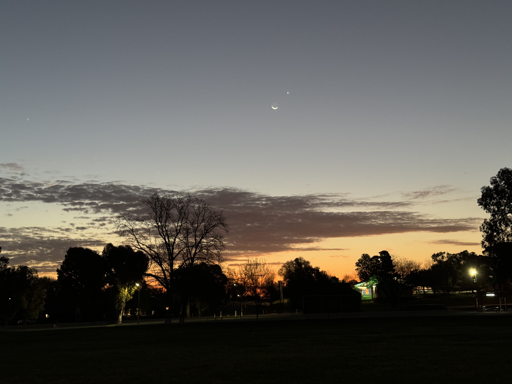
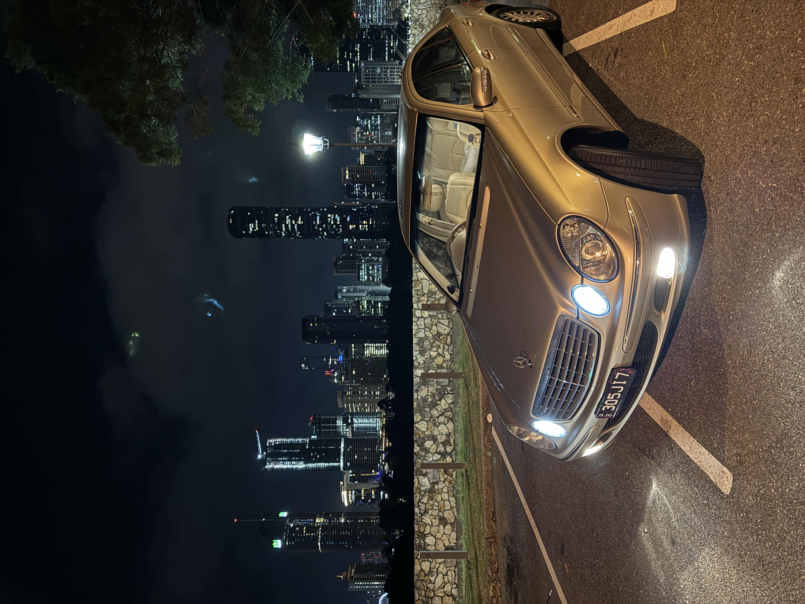
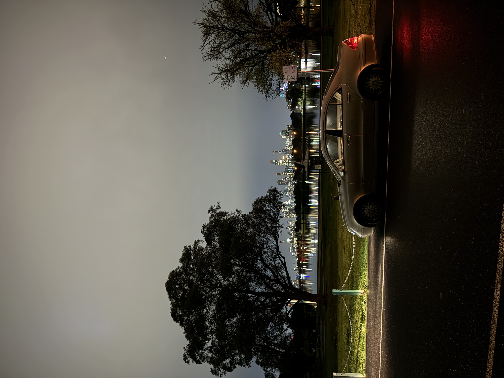

Stopped at Nerrandera for about 30 minutes to watch the sunset and chill (was very pretty)

This was my first time driving between the two cities in one day so I took photos of Claire with each city backdrop.

Brisbane (4:00am):

And Melbourne (11:30pm):

