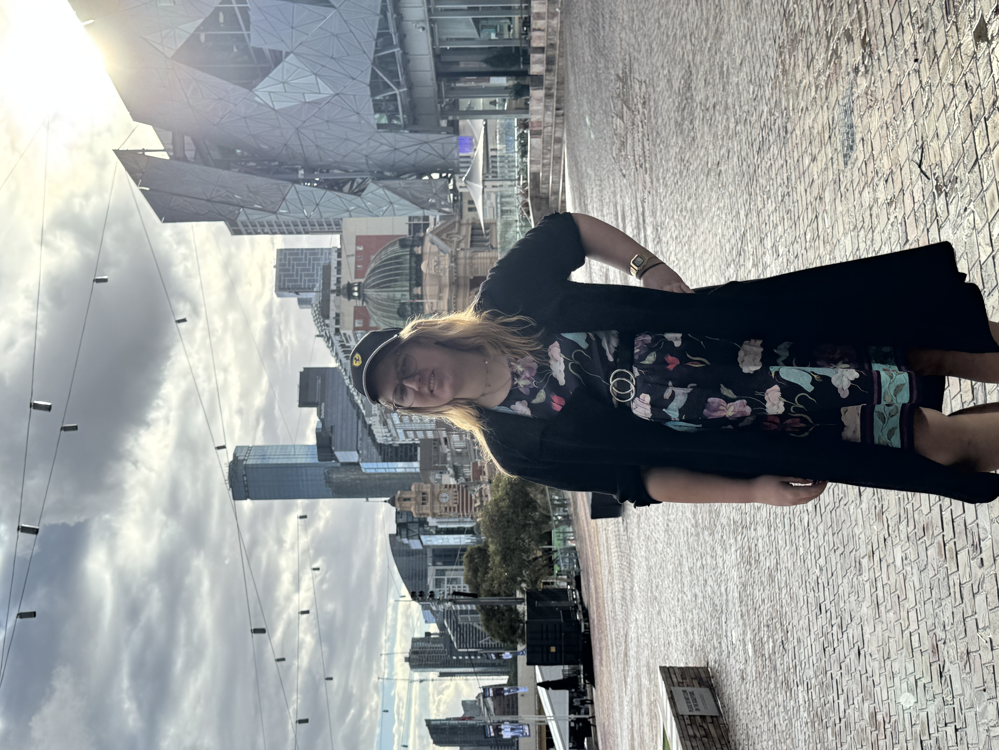

# Natalie Rose

  

🏳️‍⚧️ 🏳️‍🌈

Queer woman with a spicy brain. Web developer, fast car enjoyer and occasional musician. Interested in making the web a
better place for everyone! ✨

💼 💼

I am currently working on a global commercial people logistics solution as a Senior Developer. I also devote my spare
time to working on a few community projects including <a href='https://www.thegrantshub.com.au/' target='_blank'>The
Grants Hub</a> and an open source reboot of The Lacuna Expanse called
<a href='https://tlecommunity.com' target='_blank'>TLE Community</a>.

I'm available for consulting work with <%= new Date().getFullYear() - 2018 %>+ years of experience in:
JavaScript/TypeScript, Ruby on Rails, Node.js, Perl, PHP, MySQL/MongoDB, React/Vue, and various CSS frameworks.

Contact me via [<%= meta.email %>](mailto:<%= meta.email %>)

🎶 🎶

Musically, I play bass in the band <a href='https://www.youtube.com/watch?v=lhxJcr4g4WI' target='_blank'>Diaspora the
Explorer</a>, with some other projects in the works. Occasionally I upload tunes to my
<a href='https://www.youtube.com/watch?v=5NbKaZNvsHI' target='_blank'>YouTube channel</a>.

## Sitemap

Links for navigating around this website

- [Blog](/blog): read the latest updates
- [Fundamentals](/fundamentals): some quotes and ideas I find inspirational
- [Now](/now): what I'm thinking about and doing at the moment
- [Recommendations](/recommendations): things I would recommend to pretty much anyone
- [Statement on AI](/ai): thinking is hard but good
- [Dotfiles](/dotfiles): old fashioned unix-y goodness
- [Drives](/drives): Long/interesting drives I've done due to chronic car love
- [Laws](/laws): A collection of interesting laws and anecdotes
- [Feeds](/feeds): Feeds from this site that can be subscribed to
- [Lacuna UI Prototype](/lacuna-ui-prototype): _blog post about this coming soon.._
