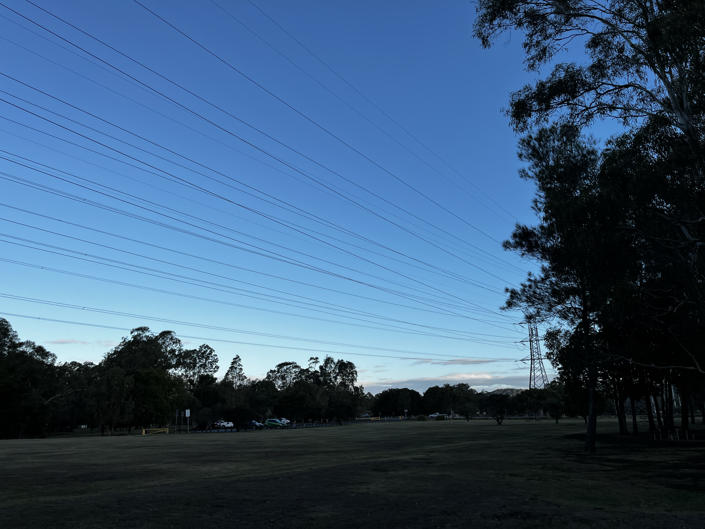
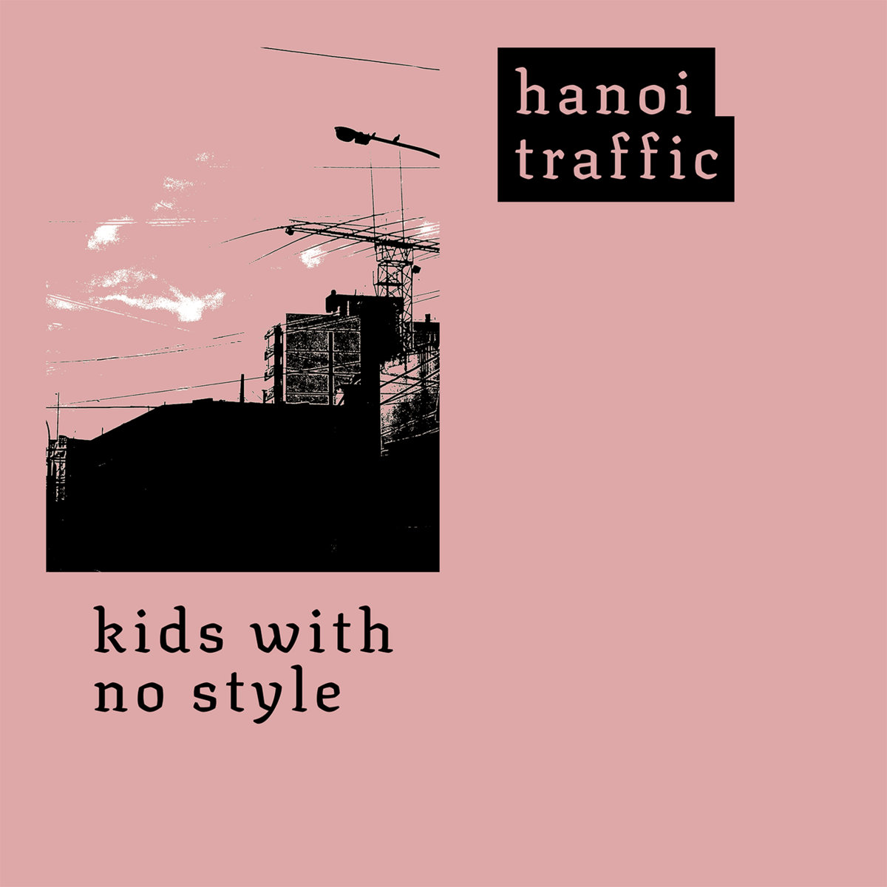

# Music

## Chill (2023)

<figure>
  <audio controls preload="metadata">
    <source src="2023/chill/chill.mp3" type="audio/mpeg" />
  </audio>
</figure>

## Tolerance Breakbeat (2023)

<figure>
  <audio controls preload="metadata">
    <source src="2023/tolerance-breakbeat/tolerance-breakbeat.mp3" type="audio/mpeg" />
  </audio>
</figure>

## Hanoi Traffic - Kids with No Style (2021)

<figure>
  <figcaption>1. Seashells</figcaption>
  <audio controls preload="metadata">
    <source src="2021/kids-with-no-style/01-seashells.mp3" type="audio/mpeg" />
  </audio>
</figure>

<figure>
  <figcaption>2. There's no money in math rock</figcaption>
  <audio controls preload="metadata">
    <source src="2021/kids-with-no-style/02-theres-no-money-in-math-rock.mp3" type="audio/mpeg" />
  </audio>
</figure>

<figure>
  <figcaption>3. Henry Rollins the guy from he never died?</figcaption>
  <audio controls preload="metadata">
    <source src="2021/kids-with-no-style/03-henry-rollins-the-guy-from-he-never-died.mp3" type="audio/mpeg" />
  </audio>
</figure>

<figure>
  <figcaption>4. Ground dog day</figcaption>
  <audio controls preload="metadata">
    <source src="2021/kids-with-no-style/04-ground-dog-day.mp3" type="audio/mpeg" />
  </audio>
</figure>

<figure>
  <figcaption>5. Two minutes in heaven is better than one minute in heaven</figcaption>
  <audio controls preload="metadata">
    <source src="2021/kids-with-no-style/05-two-minutes-in-heaven-is-better-than-one-minute-in-heaven.mp3" type="audio/mpeg" />
  </audio>
</figure>

<figure>
  <figcaption>6. Goodbye crocodile (I'll see you in a while)</figcaption>
  <audio controls preload="metadata">
    <source src="2021/kids-with-no-style/06-goodbye-crocodile-ill-see-you-in-a-while.mp3" type="audio/mpeg" />
  </audio>
</figure>

## In the Stars (2020)

<figure>
  <audio controls preload="metadata">
    <source src="2020/in-the-stars/in-the-stars.mp3" type="audio/mpeg" />
  </audio>
</figure>

## A Public Void (2018)

<figure>
  <audio controls preload="metadata">
    <source src="2018/a-public-void/a-public-void.mp3" type="audio/mpeg" />
  </audio>
</figure>
